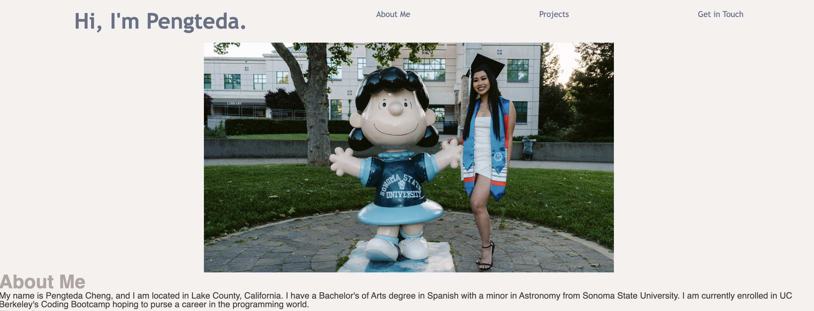

# Pengteda's Portfolio

I needed to create a website that displays my work as a developer. It has an about me section describing a little bit about myself, 
a project section with placeholder images and links that lead to the placeholder, and a section where I can be contacted with a name and enail. 

## Languages and tools:
* HTML
* CSS
* VS Code



[My Portfolio](https://teedaa.github.io/my-coding-portfolio)


Below is a code snippet describing the flexbox codes used to position the main image of myself on my portfolio. 
```
.hero{
    width:50%;
    height:auto;
    display: flex;
    justify-content: center;
    margin-left: auto;
    margin-right: auto;
}

```
# Credits
Pengteda Cheng

[Github](https://github.com/teedaa)